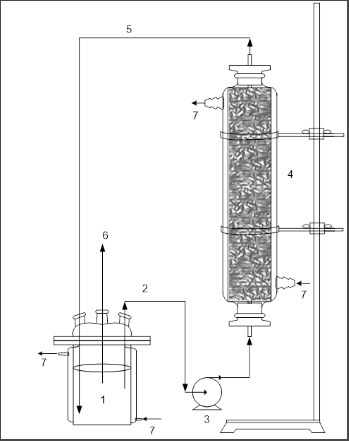

# Iniciação Tecnológica - Química - UFPR

Este repositório descreve a minha participação - Nicoli Lourenço - enquanto aluna do curso de Química da UFPR e bolsista PIBITI/CNPq no projeto [PRODUÇÃO ENZIMÁTICA DE BIODIESEL POR HIDROESTERIFICAÇÃO EM BIORREATOR EM COLUNA (LEITO EMPACOTADO)](http://www.siepe.ufpr.br/2014/einti/1473.html) apresentado na [6a edição do evento SIEPE - Semana Integrada de Ensino Pesquisa e Extensão](http://www.siepe.ufpr.br/2014/).

### O Programa de Iniciação Tecnológica

O [PIBITI (Programa Institucional de Bolsas de Iniciação em Desenvolvimento Tecnológico e Inovação)](https://memoria.cnpq.br/pibiti) é uma iniciativa do [CNPq (Conselho Nacional de Desenvolvimento Científico e Tecnológico)](https://www.gov.br/cnpq/pt-br/acesso-a-informacao/institucional/institucional) que visa fomentar a participação de jovens universitários em atividades, métodos, saberes e práticas relacionadas ao avanço tecnológico e à criação de inovações.

### O Laboratório

O [Laboratório de Tecnologia Enzimática e Biocatálise (LTEB)](https://lteb.ufpr.br), do Departamento de Química da UFPR, realiza pesquisas em processos de biocatálise, com foco em lipases, atuando na produção, purificação e aprimoramento de enzimas microbianas para aplicações industriais, biologia molecular e engenharia de proteínas.

### A apresentação do estudo - SIEPE

A [SIEPE](http://www.siepe.ufpr.br/) é um evento anual promovido pela UPFR (Univeridade Federal do Paraná) com o objetivo de promover a interação entre pesquisadores da universidade e extensionistas além de divulgar interna e externamente os trabalhos de iniciação científica, os de iniciação em desenvolvimento tecnológico e inovação, os projetos e programas de extensão e as atividades formativas desenvolvidas na instituição.

## O Projeto

### Objetivo

O biodiesel é um importante combustível utilizado no cenário da crescente utilização de biocombustíveis como alternativas sustentáveis, menos poluentes e oriundas de fontes de energia renováveis. Tomando como contexto de estudo os processos atuais de produção industrial do biodiesel (transesterificação alcalina ou esterificação mediada por catalisadores), dois pontos de melhoria são observados: custo do processo e quantidade de subprodutos formados. Assim, o estudo realizado visa o desenvolvimento de um novo processo de fabricação de biodiesel como alternativa aos processos atuais utilizando resíduos (óleos usados e bagaço de cana de açúcar) e enzimas lipases do fungo Rhizopus microsporus.

## Materiais e Ferramentas

- Fungo Rhizopus microsporus: microorganismo responsável pela produção das enzimas lipases, agente catalisador da reação química que dá origem ao biodiesel; 
- Bagaço de cana-de-açúcar: é o suporte para o fungo e suas enzimas,  
- Acidos graxos: mistura de óleos provenientes da borra de óleo de soja e ácido oleico;
- Biorreator de leito fixo: equipamento que abriga os materiais onde acontece a reação química. 

    

Na imagem acima, o esquema do bioreator: 
1) reservatório contendo meio reacional; 
2) meio reacional em recirculação; 
3) bomba peristáltica; 
4) coluna de vidro preenchida com sólido fermentado; 
5) meio reacional em recirculação;
6) amostragem; 
7) circulação de água termostatizada.
 

## Experimentos e Análises

O experimento consiste nas etapas descritas a seguir.

-produzir lipases com o fundo tal utilizando o processo de fermentacao...
-comparacao de atividades de esterificacao...
-verificar efeito da razao molar e temperatura da reacao com diferentes materias graxas...
-processo otimizado de esterificacao p/ producao de esteres etilicos

1)  
2)  
3)  
4)  
5)  
6)  
7) 

## Resultados

Foram realizados estudos da variação da razão molar (etanol: ácido graxo) e da temperatura para o aumento da conversão em éster nas reações de esterificação.

Os melhores resultados foram obtidos para as reações com razão molar 10:1 (etanol: ácido graxo) a 40 ºC, com conversão de 98% para o ácido oleico e 86% para mistura de ácidos graxos da borra de soja após 48 h de reação. 
A partir da melhor razão molar obtida, foram realizados experimentos a 35 ºC e a 40 ºC.

 Com esses resultados, o processo se mostrou como uma alternativa viável de produção de biodiesel.

 

## Apresentação e equipe

O projeto foi apresentado na 6a edição da SIEPE e contou com a minha participação, Nicoli Lourenço, como aluna bolsista de inovação tecnologica, da professora orientadora dra. Nádia Krieger e da aluna doutoranda Vanderleia Botton. 
