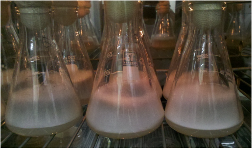
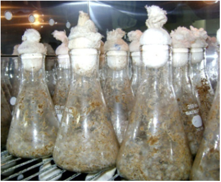
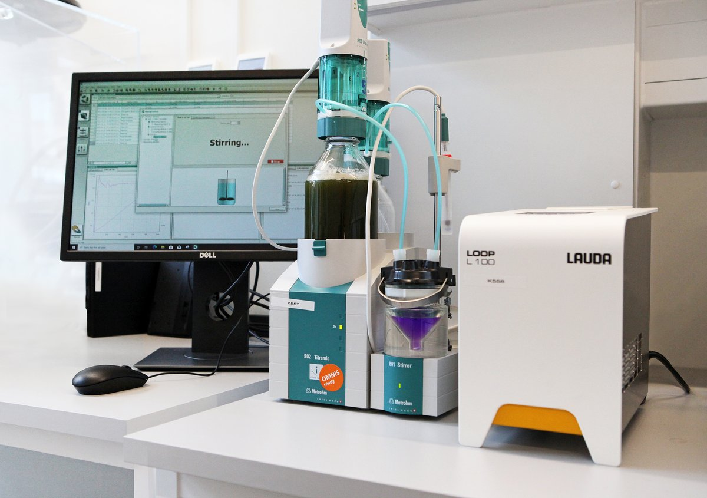
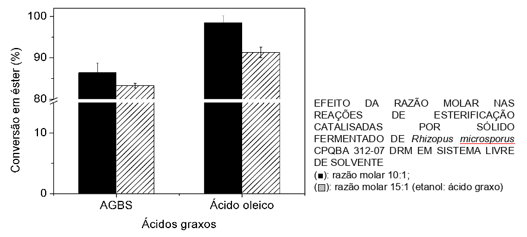
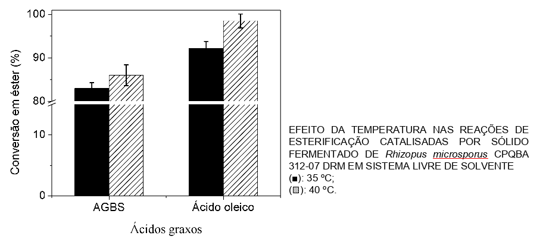
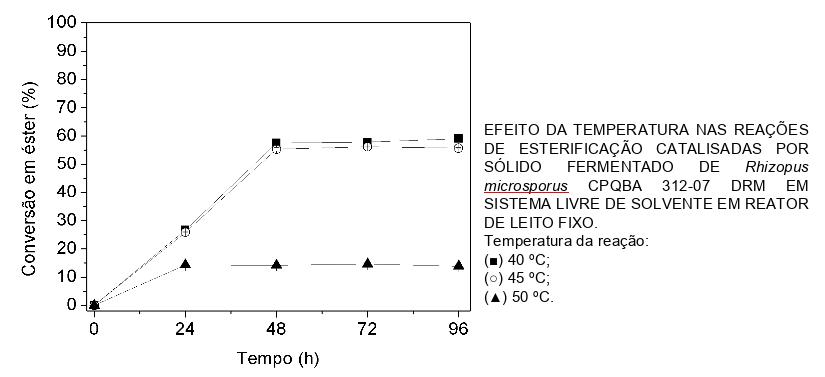

# Iniciação Tecnológica - Química - UFPR

Este repositório descreve a minha participação - Nicoli Lourenço - enquanto aluna do curso de Química da UFPR e bolsista PIBITI/CNPq no projeto [PRODUÇÃO ENZIMÁTICA DE BIODIESEL POR HIDROESTERIFICAÇÃO EM BIORREATOR EM COLUNA (LEITO EMPACOTADO)](http://www.siepe.ufpr.br/2014/einti/1473.html) apresentado na [6a edição do evento SIEPE - Semana Integrada de Ensino Pesquisa e Extensão](http://www.siepe.ufpr.br/2014/).

### O Programa de Iniciação Tecnológica

O [PIBITI (Programa Institucional de Bolsas de Iniciação em Desenvolvimento Tecnológico e Inovação)](https://memoria.cnpq.br/pibiti) é uma iniciativa do [CNPq (Conselho Nacional de Desenvolvimento Científico e Tecnológico)](https://www.gov.br/cnpq/pt-br/acesso-a-informacao/institucional/institucional) que visa fomentar a participação de jovens universitários em atividades, métodos, saberes e práticas relacionadas ao avanço tecnológico e à criação de inovações.

### O Laboratório

O [Laboratório de Tecnologia Enzimática e Biocatálise (LTEB)](https://lteb.ufpr.br), do Departamento de Química da UFPR, realiza pesquisas em processos de biocatálise, com foco em lipases, atuando na produção, purificação e aprimoramento de enzimas microbianas para aplicações industriais, biologia molecular e engenharia de proteínas.

### A apresentação do estudo - SIEPE

A [SIEPE](http://www.siepe.ufpr.br/) é um evento anual promovido pela UPFR (Univeridade Federal do Paraná) com o objetivo de promover a interação entre pesquisadores da universidade e extensionistas além de divulgar interna e externamente os trabalhos de iniciação científica, os de iniciação em desenvolvimento tecnológico e inovação, os projetos e programas de extensão e as atividades formativas desenvolvidas na instituição.

## O Projeto

### Objetivo

O biodiesel é um importante combustível utilizado no cenário da crescente utilização de biocombustíveis como alternativas sustentáveis, menos poluentes e oriundas de fontes de energia renováveis. Tomando como contexto de estudo os processos atuais de produção industrial do biodiesel (transesterificação alcalina ou esterificação mediada por catalisadores), dois pontos de melhoria são observados: custo do processo e quantidade de subprodutos formados. Assim, o estudo realizado visa o desenvolvimento de um novo processo de fabricação de biodiesel como alternativa aos processos atuais utilizando resíduos (óleos usados e bagaço de cana de açúcar) e enzimas lipases do fungo Rhizopus microsporus.

## Materiais e Ferramentas

- Fungo Rhizopus microsporus: microorganismo responsável pela produção das enzimas lipases, agente catalisador da reação química que dá origem ao biodiesel; 
- Bagaço de cana-de-açúcar: é o suporte para o fungo e suas enzimas,  
- Acidos graxos: mistura de óleos provenientes da borra de óleo de soja e ácido oleico, óleo puro (padrão), utilizado como parâmetro de comparação;
- Biorreator de leito fixo: equipamento que abriga os materiais onde acontece a reação química. 

    

Na imagem acima, o esquema do bioreator: 
1) reservatório contendo meio reacional; 
2) meio reacional em recirculação; 
3) bomba peristáltica; 
4) coluna de vidro preenchida com sólido fermentado; 
5) meio reacional em recirculação;
6) amostragem; 
7) circulação de água termostatizada.
 

## Experimentos e Análises

O experimento consiste nas etapas descritas a seguir.

1) Produção de lipases pelo fungo Rhizopus microsporus por fermentação em estado sólido (FES): essa etapa consiste em "repicar" um pedaço do micélio do fungo R. microsporus em frascos erlenmeyers contendo Ágar batata-dextrose (BDA), produto comumente utilizado para o cultivo de microorganismos. Os frascos são então incubados sob temperatura de 30° durante 7 dias. Passado o periodo de incubação, os esporos do fungo são coletados e suspensos em solução para aplicação no bagaço de cana de açucar.

    

2) Fermentação em estado sólido: Com a solução onde os esporos são suspensos, é possível realizar a fermentação do bagaço de cana de açucar, sendo que este funciona como suporte para a enzima lipase que o fungo libera para o meio extracelular para sua digestão. Inicialmente, é adicionado ao bagaço, com apenas 10% de umidade uma solução umedecedora nutriente contendo uréia (4 g/L), lactose (5 g/L), K2HPO4 (5 g/L), MgSO4∙7H2O (1 g/L),  solução de oligoelementos (4 mL/L) e óleo de soja. Os frascos foram mantidos em estufa a 40 ºC por 18 h, seguindo de 24 sob temperatura de -18 °C e da liofilização (método de secagem) até umidade de 10%.  

    

3) Atividade de esterificação das enzimas: Finalizada a fermentação em estado sólido, pode-se aplicar o bagaço fermantado diretamente em alguns ensaios de qualificação. O principal utilizado neste experimento foi o método de titulação pH Stat. O pH Stat é um equipamento que realiza a titulação de um meio líquido, sob temperatura controlada, a um pH definido. Para esse ajuste de pH, o equipamento libera aos poucos NaOH (hidroxido de sódio) ao meio ácido. No caso do experimento aqui realizado, a intenção era verificar qual dos meios de cultivo (frascos contendo sólido fermentado), possuiria maior converão de ácidos graxos em éster. Quanto menor a quantidade de base NaOH liberada no meio, maior é a conversão de ácidos graxos em éster, ou seja, maior a conversão da mistura de óleos usado em uma mistura de ésteres.

    

ref: https://food.au.dk/foodhay/instruments/proteomic-and-metabolomic-platform/icp-oes/ph-stat-titration 

4) Aplicação da enzima + suporte em reações de esterificação: após definir qual dos meios de cultura teve melhor atividade de esterificação (maior conversão em éster), o mesmo foi submetido à diferentes condições reacionais de temperatura e razões molares de ácidos graxos/ácido oleico. Para o ensaio de razão molar, foi adicionado a 1,8 g de sólido fermentado 30 mmol de ácido graxo/ácido oleico e etanol na razão molar 10:1 (10 mol de etanol para 1 mol de ácido graxo). O meio foi submetido a agitação de 200 rpm por 48 h a 40 ºC. Os valores apresentados representam as médias das análises em triplicata ± o erro padrão da média. p > 0,05 para a conversão dos AGBS.

    

 
 
 Observa-se que os melhores resultados de conversão de ácido graxo e ácido oleico foram obtidos na razão molar 10:1. A partir disso, estudou-se também a influência da variação da temperatura o meio de reação. O gráfico a seguir demonstra a conversão em razão da temperatura para os ácidos graxos e ácido oleico, utilizando ainda a razão molar 10:1.
 

    

 
A partir disso, nota-se que a temperatura ótima para a realização da conversão de ácidos graxos em ésteres utilizando a enzima lipase, é a de 40 °C.

5)  Aplicação do Sólido Fermentado no Biorreator de Leito Fixo: após testadas quais seriam as melhores condições para a reação utilizando o sólido fermentado, foram dimensionadas as quantidades de reagentes que seriam aplicados no biorreator, sendo elas: 83 g de etanol, 49,5 g de AGBS (razão molar etanol: AGBS 10:1), 12 g sólido fermentado (base seca), vazão de recirculação 5 mL min-1.

    

 
Conforme citado no item "Materiais e Ferramentas", o meio reativo recircula pelo sistema, saindo do reservatório, passando pelo sólido fermentado e retornando ao reservatório. O sistema ficou em recirculação pelo período de 96 horas, onde foram recolhidas alíquotas do meio reacional de 24 em 24 horas. 

    

 
Conforme nota-se acima, a conversão ocorre gradativamente até 48, onde a reação atige seu máximo de conversão e se mantém constante para as temperaturas de 40 e 45°C. A partir disso também, nota-se que a enzima mostrou-se mais eficiente na faixa de 40-45 °C e em 50 °C sua atividade não foi tão boa, o que pode ser causa de um possível desnaturamento da enzima.

## Resultados

Foram realizados estudos da variação da razão molar (etanol: ácido graxo) e da temperatura para o aumento da conversão em éster nas reações de esterificação.

Os melhores resultados foram obtidos para as reações com razão molar 10:1 (etanol: ácido graxo) a 40 ºC, com conversão de 98% para o ácido oleico e 86% para mistura de ácidos graxos da borra de soja após 48 h de reação. 
A partir da melhor razão molar obtida, foram realizados experimentos a 35 ºC e a 40 ºC.

 Com esses resultados, o processo se mostrou como uma alternativa viável de produção de biodiesel.

 

## Apresentação e equipe

O projeto foi apresentado na 6a edição da SIEPE e contou com a minha participação, Nicoli Lourenço, como aluna bolsista de inovação tecnologica, da professora orientadora dra. Nádia Krieger e da aluna doutoranda Vanderleia Botton. 
